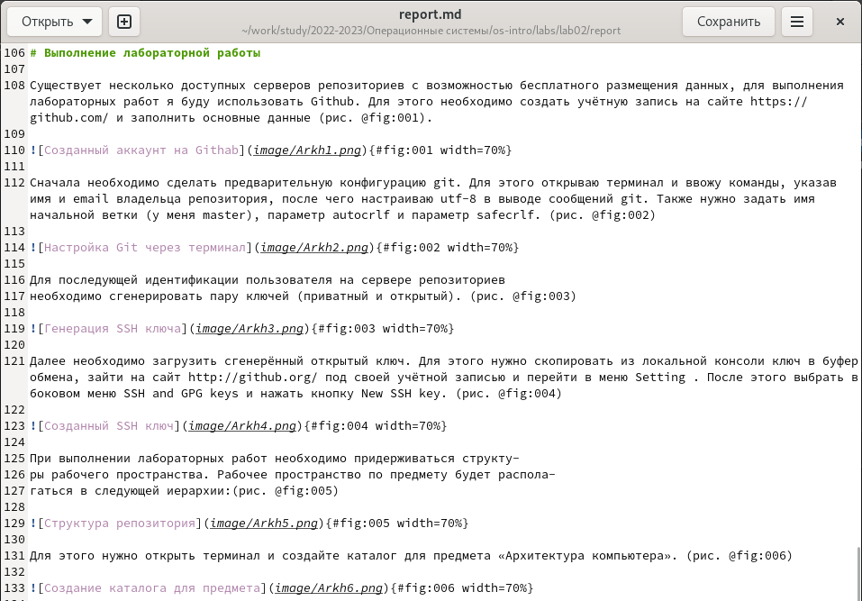

---
## Front matter
lang: ru-RU
title: Отчёт по лабораторной работе №3
subtitle: Архитектура компьютера
author:
  - Скандарова Полина Юрьевна
institute:
  - Российский университет дружбы народов, Москва, Россия
date: 24 февраля 2023

## i18n babel
babel-lang: russian
babel-otherlangs: english

## Formatting pdf
toc: false
toc-title: Содержание
slide_level: 2
aspectratio: 169
section-titles: true
theme: metropolis
header-includes:
 - \metroset{progressbar=frametitle,sectionpage=progressbar,numbering=fraction}
 - '\makeatletter'
 - '\beamer@ignorenonframefalse'
 - '\makeatother'
---

# Информация

## Докладчик

:::::::::::::: {.columns align=center}
::: {.column width="70%"}

  * Скандарова Полина Юрьевна
  * НПИбд-02-22
  * Российский университет дружбы народов
  * [1132221815@pfur.ru](mailto:1132221815@pfur.ru)
  * <https://github.com/pyskandarova>

# Вводная часть

## Теоретическое введение

Чтобы создать заголовок, используйте знак ( # )
**Чтобы задать для текста полужирное начертание, заключите его в двойные звездочки**
*Чтобы задать для текста курсивное начертание, заключите его в одинарные звездочки*
***Чтобы задать для текста полужирное и курсивное начертание, заключите его в тройные звездочки***
Блоки цитирования создаются с помощью символа ( > )
Неупорядоченный (маркированный) список можно отформатировать с помощью звездочек или тире
Чтобы вложить один список в другой, добавьте отступ для элементов дочернего списка
Упорядоченный список можно отформатировать с помощью соответствующих цифр
Синтаксис Markdown для встроенной ссылки состоит из части [link text] , представляющей текст гиперссылки, и части (file-name.md) – URL-адреса или имени файла, на который дается ссылка
Markdown поддерживает как встраивание фрагментов кода в предложение, так и их размещение между предложениями в виде отдельных огражденных блоков. Огражденные блоки кода — это простой способ выделить синтаксис для фрагментов кода. Общий формат огражденных блоков кода

## Цели и задачи

- Научиться оформлять отчёты с помощью легковесного языка разметки Markdown.

# Выполнение работы

## Выполнение задания

- Нужно сделать отчёт по предыдущей лабораторной работе в формате Markdown.

:::
::: {.column width="30%"}

:::
::::::::::::::

# Результаты

## Выводы

- Я научилась оформлять отчёты с помощью легковесного языка разметки Markdown.

## Итоговый слайд

- Неспасибо за невнимание
