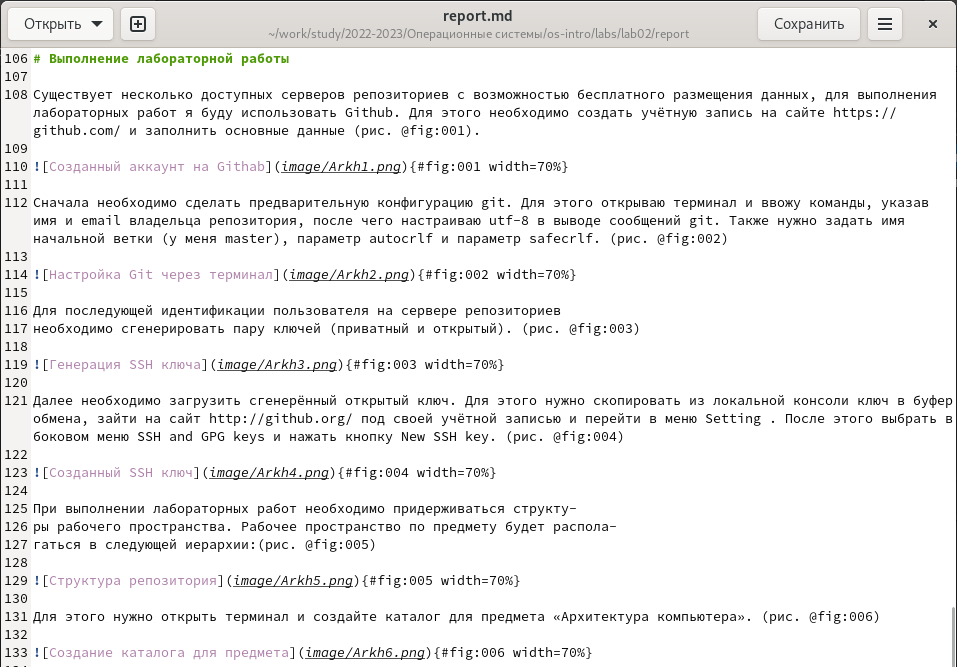

---
## Front matter
title: "Отчёт по лабораторной работе №3"
subtitle: "Архитектура компьютера"
author: "Скандарова Полина Юрьевна"

## Generic otions
lang: ru-RU
toc-title: "Содержание"

## Bibliography
bibliography: bib/cite.bib
csl: pandoc/csl/gost-r-7-0-5-2008-numeric.csl

## Pdf output format
toc: true # Table of contents
toc-depth: 2
lof: true # List of figures
lot: true # List of tables
fontsize: 12pt
linestretch: 1.5
papersize: a4
documentclass: scrreprt
## I18n polyglossia
polyglossia-lang:
  name: russian
  options:
	- spelling=modern
	- babelshorthands=true
polyglossia-otherlangs:
  name: english
## I18n babel
babel-lang: russian
babel-otherlangs: english
## Fonts
mainfont: PT Serif
romanfont: PT Serif
sansfont: PT Sans
monofont: PT Mono
mainfontoptions: Ligatures=TeX
romanfontoptions: Ligatures=TeX
sansfontoptions: Ligatures=TeX,Scale=MatchLowercase
monofontoptions: Scale=MatchLowercase,Scale=0.9
## Biblatex
biblatex: true
biblio-style: "gost-numeric"
biblatexoptions:
  - parentracker=true
  - backend=biber
  - hyperref=auto
  - language=auto
  - autolang=other*
  - citestyle=gost-numeric
## Pandoc-crossref LaTeX customization
figureTitle: "Рис."
tableTitle: "Таблица"
listingTitle: "Листинг"
lofTitle: "Список иллюстраций"
lotTitle: "Список таблиц"
lolTitle: "Листинги"
## Misc options
indent: true
header-includes:
  - \usepackage{indentfirst}
  - \usepackage{float} # keep figures where there are in the text
  - \floatplacement{figure}{H} # keep figures where there are in the text
---

#Теоретическое введение

Чтобы создать заголовок, используйте знак ( # )
**Чтобы задать для текста полужирное начертание, заключите его в двойные звездочки**
*Чтобы задать для текста курсивное начертание, заключите его в одинарные звездочки*
***Чтобы задать для текста полужирное и курсивное начертание, заключите его в тройные звездочки***
Блоки цитирования создаются с помощью символа ( > )
Неупорядоченный (маркированный) список можно отформатировать с помощью звездочек или тире
Чтобы вложить один список в другой, добавьте отступ для элементов дочернего списка
Упорядоченный список можно отформатировать с помощью соответствующих цифр
Синтаксис Markdown для встроенной ссылки состоит из части [link text] , представляющей текст гиперссылки, и части (file-name.md) – URL-адреса или имени файла, на который дается ссылка
Markdown поддерживает как встраивание фрагментов кода в предложение, так и их размещение между предложениями в виде отдельных огражденных блоков. Огражденные блоки кода — это простой способ выделить синтаксис для фрагментов кода. Общий формат огражденных блоков кода

# Цель работы

Научиться оформлять отчёты с помощью легковесного языка разметки Markdown.

# Выполнение задания

Нужно сделать отчёт по предыдущей лабораторной работе в формате Markdown (рис. @fig:001).

{#fig:001 width=70%}

# Выводы

Я научилась оформлять отчёты с помощью легковесного языка разметки Markdown.
