---
## Front matter
lang: ru-RU
title: Лабораторная работа No 4
subtitle: Архитектура компьютера
author:
  - Скандарова П.Ю.
institute:
  - Российский университет дружбы народов, Москва, Россия
date: 24 февраля 2023

## i18n babel
babel-lang: russian
babel-otherlangs: english

## Formatting pdf
toc: false
toc-title: Содержание
slide_level: 2
aspectratio: 169
section-titles: true
theme: metropolis
header-includes:
 - \metroset{progressbar=frametitle,sectionpage=progressbar,numbering=fraction}
 - '\makeatletter'
 - '\beamer@ignorenonframefalse'
 - '\makeatother'
---

# Информация

## Докладчик

:::::::::::::: {.columns align=center}
::: {.column width="70%"}

  * Скандарова Полина Юрьевна
  * НПИбд-02-22
  * Российский университет дружбы народов
  * [1132221815@pfur.ru](mailto:1132221815@pfur.ru)
  * <https://github.com/pyskandarova>

# Вводная часть

## Цель работы

Приобретение практических навыков взаимодействия пользователя с системой посредством командной строки.

## Теоретическое введение

- **Формат команды.** Командой в операционной системе называется записанный по специальным правилам текст (возможно с аргументами), представляющий собой указание на выполнение какой-либо функций (или действий) в операционной системе. Обычно первым словом идёт имя команды, остальной текст — аргументы или опции, конкретизирующие действие.
- **Команда man.** Команда man используется для просмотра (оперативная помощь) в диалоговом режиме руководства (manual) по основным командам операционной системы типа Linux.
- **Команда cd.** Команда cd используется для перемещения по файловой системе операционной системы типа Linux.
- **Команда pwd.** Для определения абсолютного пути к текущему каталогу используется команда pwd (print working directory).
- **Сокращения имён файлов.** В работе с командами, в качестве аргументов которых выступает путь к какому-либо каталогу или файлу, можно использовать сокращённую запись пути.
- **Команда ls.** Команда ls используется для просмотра содержимого каталога.
- **Команда mkdir.** Команда mkdir используется для создания каталогов.
- **Команда rm.** Команда rm используется для удаления файлов и/или каталогов.
- **Команда history.** Для вывода на экран списка ранее выполненных команд используется команда history. Выводимые на экран команды в списке нумеруются. К любой команде из выведенного на экран списка можно обратиться по её номеру в списке, воспользовавшись конструкцией !<номер_команды>.

# Выполнение лабораторной работы

## Команда pwd

Определяю полное имя домашнего каталога. Далее относительно этого каталога будут выполняться последующие упражнения.

:::
::: {.column width="30%"}

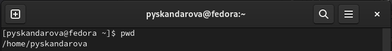

:::
::::::::::::::

## Команда ls

Перехожу в каталог /tmp и вывожу на экран содержимое каталога /tmp. Для этого использую команду ls с различными опциями. Опция "-a" отображает скрытые файлы, опция "-F" - типы файлов, опция "-l" - подробную информацию о файлах и каталогах. Определяю, есть ли в каталоге /var/spool подкаталог с именем cron. Его там нет. Перехожу в домашний каталог и вывожу на экран его содержимое. Владельцем всех файлов и каталогов являюсь я.

:::
::: {.column width="30%"}

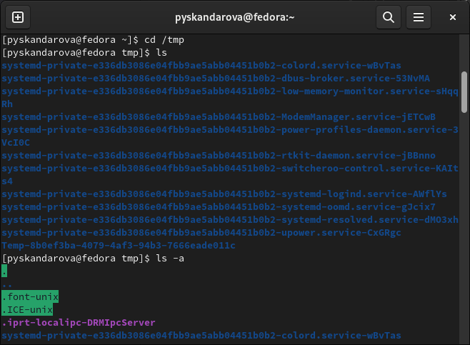

:::
::::::::::::::

:::
::: {.column width="30%"}

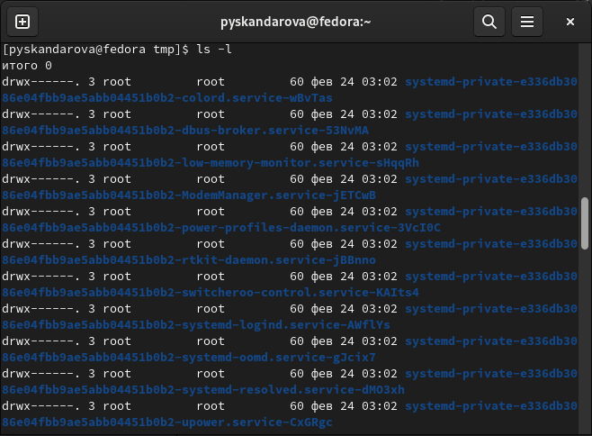

:::
::::::::::::::

:::
::: {.column width="30%"}

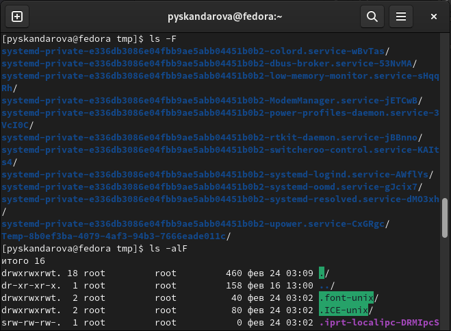

:::
::::::::::::::

:::
::: {.column width="30%"}

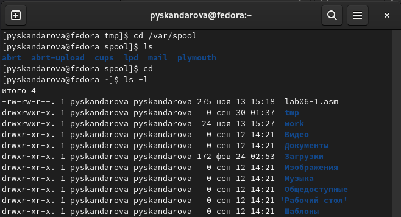

:::
::::::::::::::

## Команды mkdir и rm

В домашнем каталоге создаю новый каталог с именем newdir. В каталоге ~/newdir создаю новый каталог с именем morefun. В домашнем каталоге создаю одной командой три новых каталога с именами letters, memos, misk, затем удаляю эти каталоги одной командой. Удаляю ранее созданный каталог ~/newdir командой rm и поверьте, был ли он удалён. Удаляю каталог ~/newdir/morefun из домашнего каталога. Проверьте, был ли каталог удалён.

:::
::: {.column width="30%"}

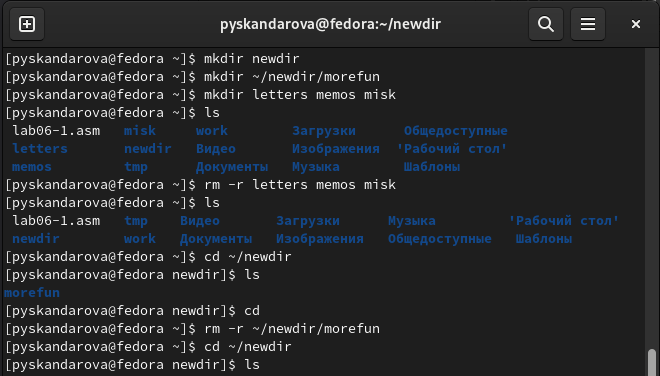

:::
::::::::::::::

## Команда man

С помощью команды man определяю, какую опцию команды ls нужно использовать для просмотра содержимого не только указанного каталога, но и подкаталогов, входящих в него.

:::
::: {.column width="30%"}

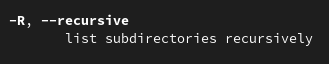

:::
::::::::::::::

:::
::: {.column width="30%"}

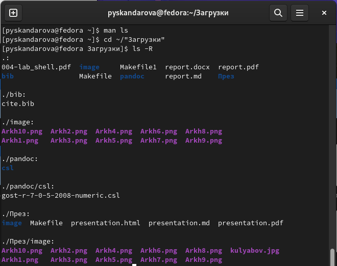

:::
::::::::::::::

## Команда man

С помощью команды man определяю набор опций команды ls, позволяющий отсортировать по времени последнего изменения выводимый список содержимого каталога с развёрнутым описанием файлов.

:::
::: {.column width="30%"}

:::
::::::::::::::

:::
::: {.column width="30%"}

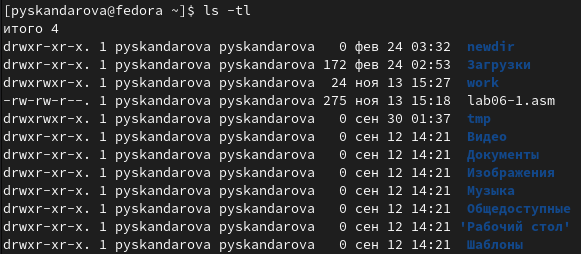

:::
::::::::::::::

## Команда man

Использую команду man для просмотра описания следующих команд: cd - перемещение по файловой	 системе, pwd - отображает полный путь до каталога, mkdir - создаёт каталоги, rmdir - удаляет каталоги, rm - удаляет файлы и каталоги.

:::
::: {.column width="30%"}

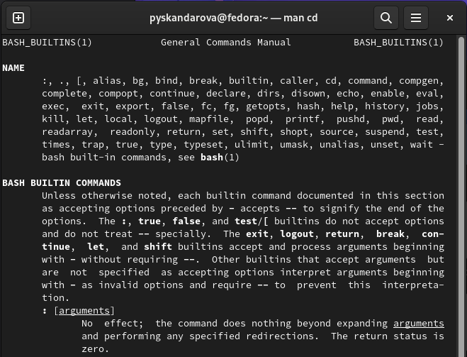

:::
::::::::::::::

:::
::: {.column width="30%"}

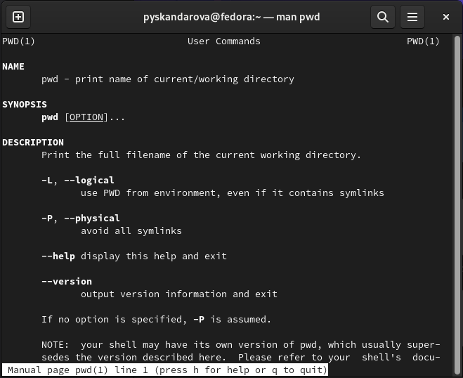

:::
::::::::::::::

:::
::: {.column width="30%"}

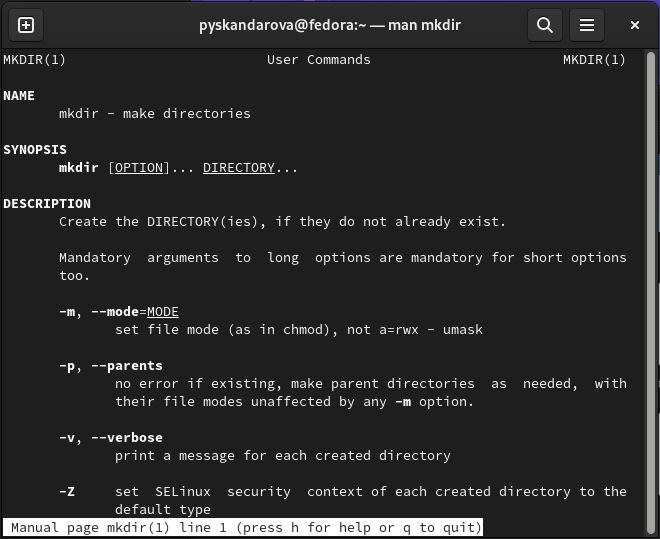

:::
::::::::::::::

:::
::: {.column width="30%"}

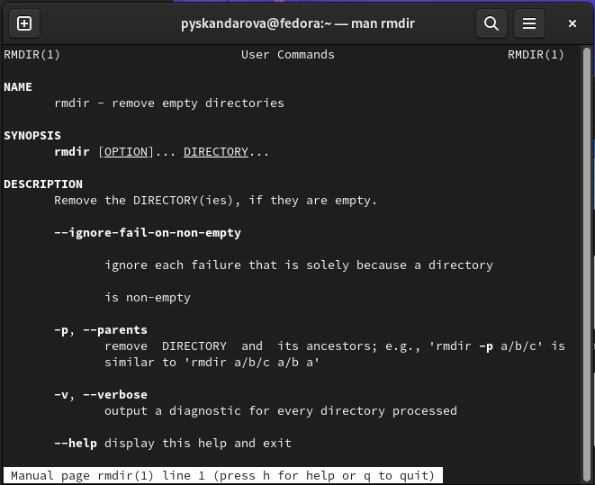

:::
::::::::::::::

:::
::: {.column width="30%"}

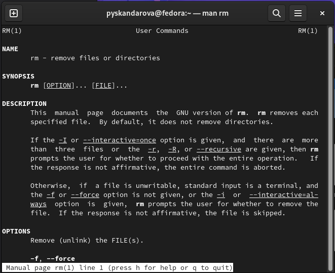

:::
::::::::::::::

## Команда history

Используя информацию, полученную при помощи команды history, выполн исполнение команды из буфера команд.

:::
::: {.column width="30%"}

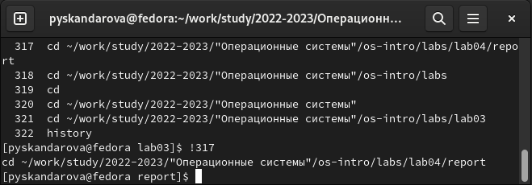

:::
::::::::::::::

# Контрольные вопросы

## 1-6

::: incremental

1. Что такое командная строка? Терминал Linux предоставляет интерфейс, в котором можно вводить команды и видеть результат, напечатанный в виде текста. Можно использовать терминал для выполнения таких задач, как перемещение файлов или навигация по каталогу, без использования графического интерфейса.
2. При помощи какой команды можно определить абсолютный путь текущего каталога? Приведите пример. При помощи команды pwd.
3. При помощи какой команды и каких опций можно определить только тип файлов и их имена в текущем каталоге? Приведите примеры. ls -F.
4. Каким образом отобразить информацию о скрытых файлах? Приведите примеры. Для того, чтобы отобразить имена скрытых файлов, необходимо использовать команду ls с опцией a.
5. При помощи каких команд можно удалить файл и каталог? Можно ли это сделать одной и той же командой? Приведите примеры. rmdir и rm.
6. Каким образом можно вывести информацию о последних выполненных пользователем командах? работы?

## 7-13

::: incremental

7. Как воспользоваться историей команд для их модифицированного выполнения? Приведите примеры. С помощью команды history.
8. Приведите примеры запуска нескольких команд в одной строке.
9. Дайте определение и приведите примера символов экранирования. Экранирование символов — замена в тексте управляющих символов на соответствующие текстовые подстановки.
10. Охарактеризуйте вывод информации на экран после выполнения команды ls с опцией l. Чтобы вывести на экран подробную информацию о файлах и каталогах, необходимо использовать опцию l. При этом о каждом файле и каталоге будет выведена следующая информация: тип файла, право доступа, число ссылок, владелец, размер, дата последней ревизии, имя файла или каталога.
11. Что такое относительный путь к файлу? Приведите примеры использования относительного и абсолютного пути при выполнении какой-либо команды. Относительный путь представляет собой путь по отношению к текущему рабочему каталогу пользователя или активных приложений.
12. Как получить информацию об интересующей вас команде? При помощи команды man.
13. Какая клавиша или комбинация клавиш служит для автоматического дополнения вводимых команд? Tab.

## Выводы

Приобретены практические навыки взаимодействия пользователя с системой посредством командной строки.

# Неспасибо за невнимание
