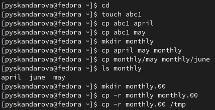
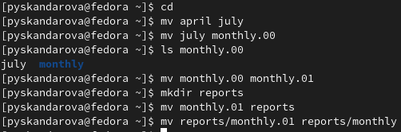
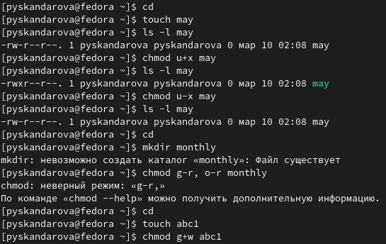
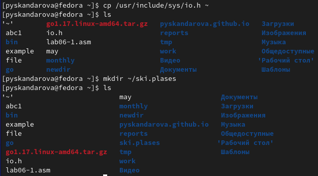
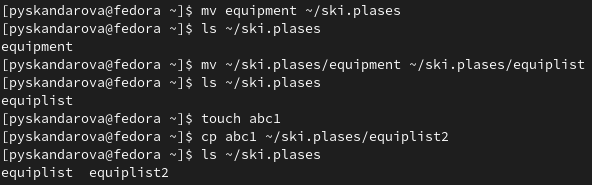
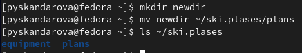
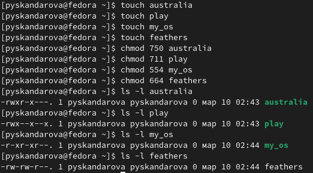
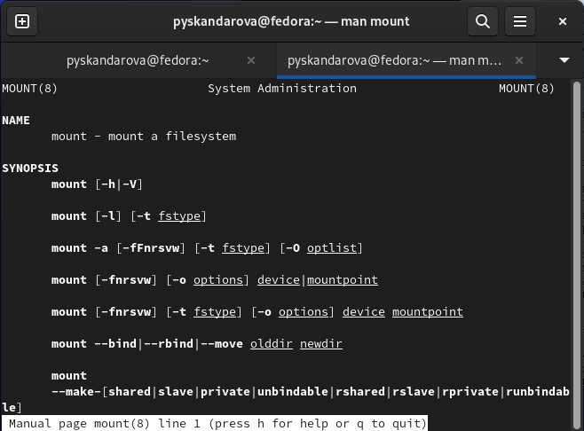
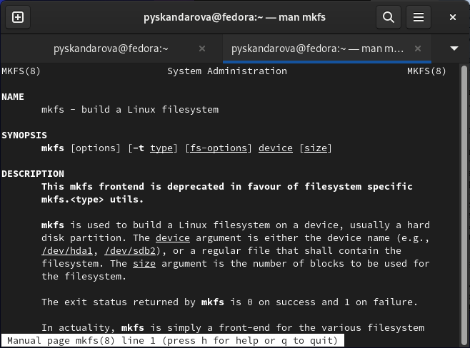
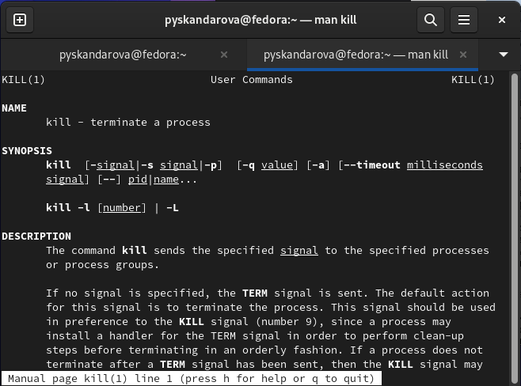

---
## Front matter
lang: ru-RU
title: Лабораторная работа №5
subtitle: Архитектура компьютеров
author:
  - Скандарова П.Ю.
institute:
  - Российский университет дружбы народов, Москва, Россия
date: 11 марта 2023

## i18n babel
babel-lang: russian
babel-otherlangs: english

## Formatting pdf
toc: false
toc-title: Содержание
slide_level: 2
aspectratio: 169
section-titles: true
theme: metropolis
header-includes:
 - \metroset{progressbar=frametitle,sectionpage=progressbar,numbering=fraction}
 - '\makeatletter'
 - '\beamer@ignorenonframefalse'
 - '\makeatother'
---

# Информация

## Докладчик

:::::::::::::: {.columns align=center}
::: {.column width="70%"}

  * Скандарова Полина Юрьевна
  * Российский университет дружбы народов
  * [1132221815@pfur.ru](mailto:1132221815@pfur.ru)
  * <https://pyskandarova.github.io/ru/>

# Вводная часть

## Цель работы

Ознакомление с файловой системой Linux, её структурой, именами и содержанием каталогов. Приобретение практических навыков по применению команд для работы с файлами и каталогами, по управлению процессами (и работами), по проверке использования диска и обслуживанию файловой системы.

# Теоретическое введение

## Команды для работы с файлами и каталогами

- Для создания текстового файла можно использовать команду touch. Формат команды: *touch имя-файла*
- Для просмотра файлов небольшого размера можно использовать команду cat. Формат команды: *cat имя-файла*
- Для просмотра файлов постранично удобнее использовать команду less. Формат команды: *less имя-файла*
- Команда head выводит по умолчанию первые 10 строк файла. Формат команды: *head [-n] имя-файла*, где n — количество выводимых строк.
- Команда tail выводит умолчанию 10 последних строк файла. Формат команды: *tail [-n] имя-файла*, где n — количество выводимых строк.
- Команда tail выводит умолчанию 10 последних строк файла. Формат команды: *tail [-n] имя-файла*, где n — количество выводимых строк.

## Команды для работы с файлами и каталогами (2)

::: incremental

**Копирование файлов и каталогов**
- Команда cp используется для копирования файлов и каталогов. Формат команды: *cp [-опции] исходный_файл целевой_файл*

**Перемещение и переименование файлов и каталогов**
- Команды mv и mvdir предназначены для перемещения и переименования файлов и каталогов. Формат команды mv: *mv [-опции] старый_файл новый_файл*

**Изменение прав доступа**
- Права доступа к файлу или каталогу можно изменить, воспользовавшись командой chmod. Сделать это может владелец файла (или каталога) или пользователь с правами администратора. Формат команды: *chmod режим имя_файла*

:::

# Выполнение лабораторной работы

## 1. Выполнить все примеры, приведённые в первой части описания лабораторной работы.

:::
::: {.column width="30%"}

:::
::::::::::::::

:::
::: {.column width="30%"}

:::
::::::::::::::

:::
::: {.column width="30%"}

:::
::::::::::::::

:::
::: {.column width="30%"}

:::
::::::::::::::

## 2. Выполнить действия, зафиксировав в отчёте по лабораторной работе используемые при этом команды и результаты их выполнения.

:::
::: {.column width="30%"}

:::
::::::::::::::

:::
::: {.column width="30%"}

:::
::::::::::::::

:::
::: {.column width="30%"}

:::
::::::::::::::

## 3. Команды chmod, необходимые для того, чтобы присвоить файлам определенные права доступа, считая, что в начале таких прав нет

:::
::: {.column width="30%"}

:::
::::::::::::::

## 4.

::: incremental

- 4.1. Для просмотра содержимого файла /etc/password нужно ввести команду: *cat /etc/passwd*
- 4.2. Для копирования файла ~/feathers в файл ~/file.old нужно ввести команду: *cp ~/feathers ~/file.old*
- 4.3. Для перемещения файла ~/file.old в каталог ~/play нужно ввести команду: *mv ~/file.old ~/play/*
- 4.4. Для копирования каталога ~/play в каталог ~/fun нужно ввести команду: *cp -r ~/play ~/fun*
- 4.5. Для перемещения каталога ~/fun в каталог ~/play и назовите его games нужно ввести команду: *mv ~/fun ~/play/games*
- 4.6. Чтобы лишить владельца файла ~/feathers права на чтение нужно ввести команду: *chmod u-r ~/feathers*

:::

## 4. (2)

::: incremental

- 4.7. Если вы попытаетесь просмотреть файл ~/feathers командой cat после того, как вы лишили владельца файла права на чтение, вы получите ошибку "Permission denied" (Отказано в доступе).
- 4.8. Если вы попытаетесь скопировать файл ~/feathers после того, как вы лишили владельца файла права на чтение, вы получите ошибку "Permission denied" (Отказано в доступе).
- 4.9. Чтобы дать владельцу файла ~/feathers право на чтение, нужно ввести команду: *chmod u+r ~/feathers*
- 4.10. Чтобы лишить владельца каталога ~/play права на выполнение, нужно ввести команду: *chmod u-x ~/play*
- 4.11. Для перехода в каталог ~/play нужно ввести команду: cd ~/play. При этом текущим каталогом станет ~/play.
- 4.12. Чтобы дать владельцу каталога ~/play право на выполнение, нужно ввести команду: *chmod u+x ~/play*

::: incremental

## 5.

**mount** - команда, которая используется для подключения файловых систем. Эта команда позволяет смонтировать файловую систему в определенный каталог, чтобы можно было получить к ней доступ. Например, для монтирования файловой системы ext4, расположенной на устройстве /dev/sdb1 в каталог /mnt/mydata нужно выполнить команду: *sudo mount -t ext4 /dev/sdb1 /mnt/mydata*.

:::
::: {.column width="30%"}

:::
::::::::::::::

**fsck** - команда, которая используется для проверки и восстановления файловых систем. Эта команда позволяет выявлять и исправлять ошибки, возникающие на файловой системе. Например, для проверки файловой системы ext4 на устройстве /dev/sda1 нужно выполнить команду: *sudo fsck -t ext4 /dev/sda1*. 

:::
::: {.column width="30%"}

:::
::::::::::::::

## 5. (2)

**mkfs** - команда, которая используется для создания файловой системы на определенном устройстве. Эта команда позволяет отформатировать устройство, чтобы создать на нем файловую систему. Например, для создания файловой системы ext4 на устройстве /dev/sdb1 нужно выполнить команду: *sudo mkfs -t ext4 /dev/sdb1*. 

:::
::: {.column width="30%"}

:::
::::::::::::::

**kill** - команда, которая используется для отправки сигнала процессу или группе процессов. Эта команда позволяет завершать процессы, останавливать их выполнение или изменять их поведение. Например, чтобы отправить сигнал SIGTERM процессу с идентификатором 1234 нужно выполнить команду: *kill 1234*. 

:::
::: {.column width="30%"}

:::
::::::::::::::

# Результаты

## Выводы

Я ознакомилась с файловой системой Linux, её структурой, именами и содержанием каталогов. Приобретены практические навыки по применению команд для работы с файлами и каталогами, по управлению процессами (и работами), по проверке использования диска и обслуживанию файловой системы.
