---
## Front matter
title: "Лабораторная работа №5"
subtitle: "Архитектура компьютеров"
author: "Скандарова Полина"

## Generic otions
lang: ru-RU
toc-title: "Содержание"

## Bibliography
bibliography: bib/cite.bib
csl: pandoc/csl/gost-r-7-0-5-2008-numeric.csl

## Pdf output format
toc: true # Table of contents
toc-depth: 2
lof: true # List of figures
lot: true # List of tables
fontsize: 12pt
linestretch: 1.5
papersize: a4
documentclass: scrreprt
## I18n polyglossia
polyglossia-lang:
  name: russian
  options:
	- spelling=modern
	- babelshorthands=true
polyglossia-otherlangs:
  name: english
## I18n babel
babel-lang: russian
babel-otherlangs: english
## Fonts
mainfont: PT Serif
romanfont: PT Serif
sansfont: PT Sans
monofont: PT Mono
mainfontoptions: Ligatures=TeX
romanfontoptions: Ligatures=TeX
sansfontoptions: Ligatures=TeX,Scale=MatchLowercase
monofontoptions: Scale=MatchLowercase,Scale=0.9
## Biblatex
biblatex: true
biblio-style: "gost-numeric"
biblatexoptions:
  - parentracker=true
  - backend=biber
  - hyperref=auto
  - language=auto
  - autolang=other*
  - citestyle=gost-numeric
## Pandoc-crossref LaTeX customization
figureTitle: "Рис."
tableTitle: "Таблица"
listingTitle: "Листинг"
lofTitle: "Список иллюстраций"
lotTitle: "Список таблиц"
lolTitle: "Листинги"
## Misc options
indent: true
header-includes:
  - \usepackage{indentfirst}
  - \usepackage{float} # keep figures where there are in the text
  - \floatplacement{figure}{H} # keep figures where there are in the text
---

# Цель работы

Ознакомление с файловой системой Linux, её структурой, именами и содержанием каталогов. Приобретение практических навыков по применению команд для работы с файлами и каталогами, по управлению процессами (и работами), по проверке использования диска и обслуживанию файловой системы.

# Теоретическое введение

**Команды для работы с файлами и каталогами**
- Для создания текстового файла можно использовать команду touch. Формат команды: *touch имя-файла*
- Для просмотра файлов небольшого размера можно использовать команду cat. Формат команды: *cat имя-файла*
- Для просмотра файлов постранично удобнее использовать команду less. Формат команды: *less имя-файла*
- Команда head выводит по умолчанию первые 10 строк файла. Формат команды: *head [-n] имя-файла*, где n — количество выводимых строк.
- Команда tail выводит умолчанию 10 последних строк файла. Формат команды: *tail [-n] имя-файла*, где n — количество выводимых строк.
- Команда tail выводит умолчанию 10 последних строк файла. Формат команды: *tail [-n] имя-файла*, где n — количество выводимых строк.

**Копирование файлов и каталогов**
- Команда cp используется для копирования файлов и каталогов. Формат команды: *cp [-опции] исходный_файл целевой_файл*

**Перемещение и переименование файлов и каталогов**
- Команды mv и mvdir предназначены для перемещения и переименования файлов и каталогов. Формат команды mv: *mv [-опции] старый_файл новый_файл*

**Изменение прав доступа**
- Права доступа к файлу или каталогу можно изменить, воспользовавшись командой chmod. Сделать это может владелец файла (или каталога) или пользователь с правами администратора. Формат команды: *chmod режим имя_файла*

# Выполнение лабораторной работы

1. Выполнить все примеры, приведённые в первой части описания лабораторной работы. (рис. @fig:001)(рис. @fig:002)(рис. @fig:003)(рис. @fig:004)

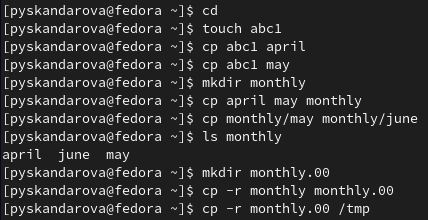{#fig:001 width=70%}

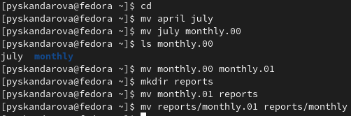{#fig:002 width=70%}

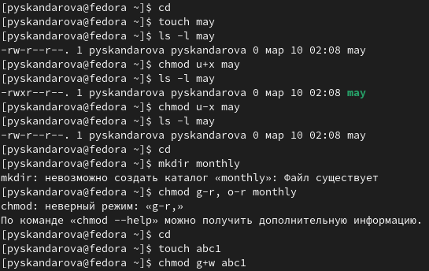{#fig:003 width=70%}

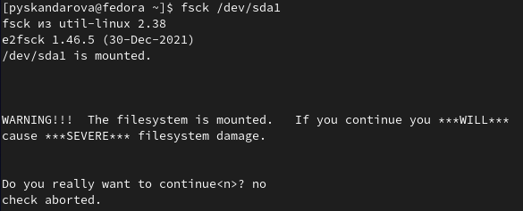{#fig:004 width=70%}

2. Выполнить действия, зафиксировав в отчёте по лабораторной работе используемые при этом команды и результаты их выполнения. (рис. @fig:005)(рис. @fig:006)(рис. @fig:007)

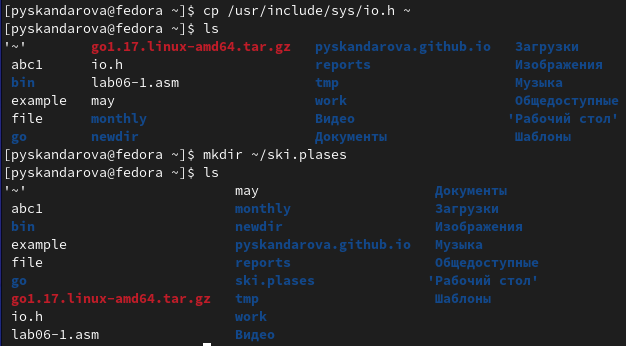{#fig:005 width=70%}

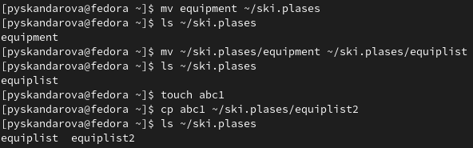{#fig:006 width=70%}

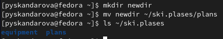{#fig:007 width=70%}

3. (рис. @fig:008)

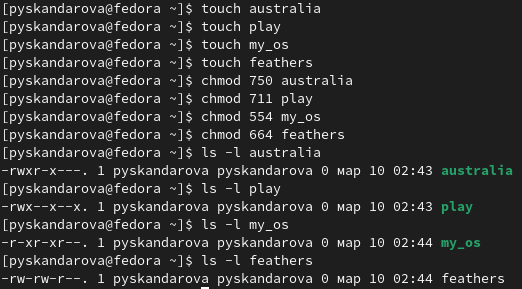{#fig:008 width=70%}

4. 
- 4.1. Для просмотра содержимого файла /etc/password нужно ввести команду: *cat /etc/passwd*
- 4.2. Для копирования файла ~/feathers в файл ~/file.old нужно ввести команду: *cp ~/feathers ~/file.old*
- 4.3. Для перемещения файла ~/file.old в каталог ~/play нужно ввести команду: *mv ~/file.old ~/play/*
- 4.4. Для копирования каталога ~/play в каталог ~/fun нужно ввести команду: *cp -r ~/play ~/fun*
- 4.5. Для перемещения каталога ~/fun в каталог ~/play и назовите его games нужно ввести команду: *mv ~/fun ~/play/games*
- 4.6. Чтобы лишить владельца файла ~/feathers права на чтение нужно ввести команду: *chmod u-r ~/feathers*
- 4.7. Если вы попытаетесь просмотреть файл ~/feathers командой cat после того, как вы лишили владельца файла права на чтение, вы получите ошибку "Permission denied" (Отказано в доступе).
- 4.8. Если вы попытаетесь скопировать файл ~/feathers после того, как вы лишили владельца файла права на чтение, вы получите ошибку "Permission denied" (Отказано в доступе).
- 4.9. Чтобы дать владельцу файла ~/feathers право на чтение, нужно ввести команду: *chmod u+r ~/feathers*
- 4.10. Чтобы лишить владельца каталога ~/play права на выполнение, нужно ввести команду: *chmod u-x ~/play*
- 4.11. Для перехода в каталог ~/play нужно ввести команду: cd ~/play. При этом текущим каталогом станет ~/play.
- 4.12. Чтобы дать владельцу каталога ~/play право на выполнение, нужно ввести команду: *chmod u+x ~/play*

5. 
**mount** - команда, которая используется для подключения файловых систем. Эта команда позволяет смонтировать файловую систему в определенный каталог, чтобы можно было получить к ней доступ. Например, для монтирования файловой системы ext4, расположенной на устройстве /dev/sdb1 в каталог /mnt/mydata нужно выполнить команду: *sudo mount -t ext4 /dev/sdb1 /mnt/mydata*. (рис. @fig:009)

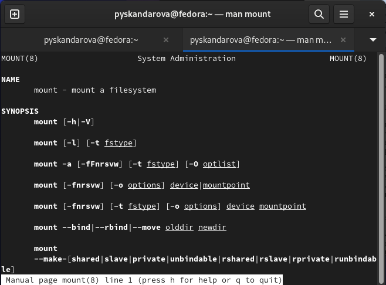{#fig:009 width=70%}

**fsck** - команда, которая используется для проверки и восстановления файловых систем. Эта команда позволяет выявлять и исправлять ошибки, возникающие на файловой системе. Например, для проверки файловой системы ext4 на устройстве /dev/sda1 нужно выполнить команду: *sudo fsck -t ext4 /dev/sda1*. (рис. @fig:010)

{#fig:010 width=70%}

**mkfs** - команда, которая используется для создания файловой системы на определенном устройстве. Эта команда позволяет отформатировать устройство, чтобы создать на нем файловую систему. Например, для создания файловой системы ext4 на устройстве /dev/sdb1 нужно выполнить команду: *sudo mkfs -t ext4 /dev/sdb1*. (рис. @fig:011)

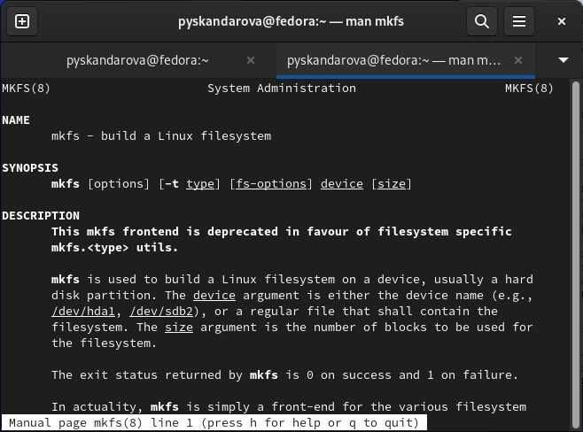{#fig:011 width=70%}

**kill** - команда, которая используется для отправки сигнала процессу или группе процессов. Эта команда позволяет завершать процессы, останавливать их выполнение или изменять их поведение. Например, чтобы отправить сигнал SIGTERM процессу с идентификатором 1234 нужно выполнить команду: *kill 1234*. (рис. @fig:012).

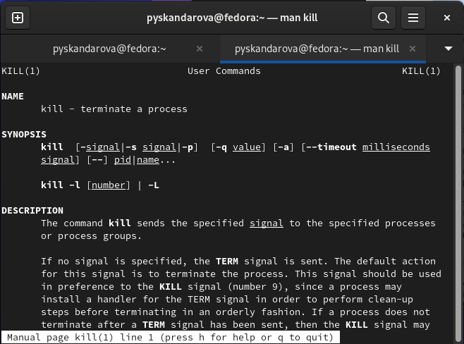{#fig:012 width=70%}

# Выводы

Я ознакомилась с файловой системой Linux, её структурой, именами и содержанием каталогов. Приобретены практические навыки по применению команд для работы с файлами и каталогами, по управлению процессами (и работами), по проверке использования диска и обслуживанию файловой системы.
