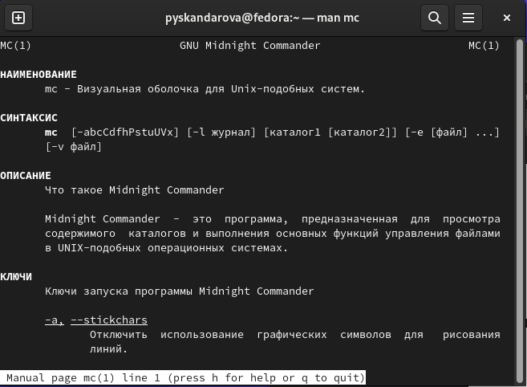

---
## Front matter
lang: ru-RU
title: Лабораторная работа №7
subtitle: Архитектура компьютеров
author:
  - Скандарова П. Ю.
institute:
  - Российский университет дружбы народов, Москва, Россия
date: 25 марта 2023

## i18n babel
babel-lang: russian
babel-otherlangs: english

## Formatting pdf
toc: false
toc-title: Содержание
slide_level: 2
aspectratio: 169
section-titles: true
theme: metropolis
header-includes:
 - \metroset{progressbar=frametitle,sectionpage=progressbar,numbering=fraction}
 - '\makeatletter'
 - '\beamer@ignorenonframefalse'
 - '\makeatother'
---

# Информация

## Докладчик

  * Скандарова Полина Юрьевна
  * Российский университет дружбы народов
  * [1132221815@pfur.ru](mailto:1132221815@pfur.ru)
  * <https://pyskandarova.github.io/ru/>

# Вводная часть

## Цели и задачи

Освоение основных возможностей командной оболочки Midnight Commander. Приобретение навыков практической работы по просмотру каталогов и файлов; манипуляций с ними.

## Теоретическое введение

::: incremental

*Функциональные клавиши mc*
- **F1** Вызов контекстно-зависимой подсказки
- **F2** Вызов пользовательского меню с возможностью создания и/или дополнения дополнительных функций
- **F3** Просмотр содержимого файла, на который указывает подсветка в активной панели (без возможности редактирования)
- **F4** Вызов встроенного в mc редактора для изменения содержания файла, на который указывает подсветка в активной панели
- **F5** Копирование одного или нескольких файлов, отмеченных в первой (активной) панели, в каталог, отображаемый на второй панели
- **F6** Перенос одного или нескольких файлов, отмеченных в первой (активной) панели, в каталог, отображаемый на второй панели
- **F7** Создание подкаталога в каталоге, отображаемом в активной панели
- **F8** Удаление одного или нескольких файлов (каталогов), отмеченных в первой (активной) панели файлов
- **F9** Вызов меню mc
- **F10** Выход из mc

:::

# Выполнение лабораторной работы - Задание по mc

## 1

## 2

## 3

## 4

## 5

## 6

## 7

#  Выполнение лабораторной работы - Задание по встроенному редактору mc

## 1-3

## 4

## 4-2

## 4-3

## Результаты

Освоены основные возможности командной оболочки Midnight Commander. Приобретены навыки практической работы по просмотру каталогов и файлов; манипуляций с ними.

## Итоговый слайд

Неспасибо за невнимание
