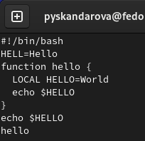
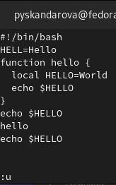
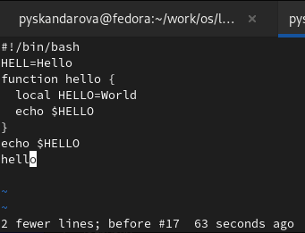

---
## Front matter
lang: ru-RU
title: Лабораторная работа №8
subtitle: Архитектура компьютеров
author:
  - Скандарова П. Ю.
institute:
  - Российский университет дружбы народов, Москва, Россия
date: 31 марта 2023

## i18n babel
babel-lang: russian
babel-otherlangs: english

## Formatting pdf
toc: false
toc-title: Содержание
slide_level: 2
aspectratio: 169
section-titles: true
theme: metropolis
header-includes:
 - \metroset{progressbar=frametitle,sectionpage=progressbar,numbering=fraction}
 - '\makeatletter'
 - '\beamer@ignorenonframefalse'
 - '\makeatother'
---

# Информация

## Докладчик

:::::::::::::: {.columns align=center}
::: {.column width="70%"}

  * Скандарова Полина Юрьевна
  * Российский университет дружбы народов
  * [1132221815@pfur.ru](mailto:1132221815@pfur.ru)
  * <https://pyskandarova.github.io/ru/>

:::
::: {.column width="30%"}

:::
::::::::::::::

# Вводная часть

## Цели и задачи

Познакомиться с операционной системой Linux. Получить практические навыки работы с редактором vi, установленным по умолчанию практически во всех дистрибутивах.

## Теоретическое введение

**Команды позиционирования**
- 0 (ноль) — переход в начало строки;
- $ — переход в конец строки;
- G — переход в конец файла;
- n G — переход на строку с номером n.

**Команды перемещения по файлу**
- Ctrl-d — перейти на пол-экрана вперёд;
- Ctrl-u — перейти на пол-экрана назад;
- Ctrl-f — перейти на страницу вперёд;
- Ctrl-b — перейти на страницу назад.

**Команды перемещения по словам**
- W или w — перейти на слово вперёд;
- n W или n w — перейти на n слов вперёд;
- b или B — перейти на слово назад;
- n b или n B — перейти на n слов назад.

## Команды редактирования

**Вставка текста** 
- а — вставить текст после курсора;
- А — вставить текст в конец строки;
- i — вставить текст перед курсором;
- n i — вставить текст n раз;
- I — вставить текст в начало строки.

**Вставка строки**
- о — вставить строку под курсором;
- О — вставить строку над курсором.

**Удаление текста**
- x — удалить один символ в буфер;
- d w — удалить одно слово в буфер;
- d $ — удалить в буфер текст от курсора до конца строки;
- d 0 — удалить в буфер текст от начала строки до позиции курсора;
- d d — удалить в буфер одну строку;
- n d d — удалить в буфер n строк.

# Выполнение лабораторной работы

## Задание 1. Создание нового файла с использованием vi

## Задание 1. Создание нового файла с использованием vi (2)

## Задание 1. Создание нового файла с использованием vi (3)

Жму клавишу Esc для перехода в командный режим после завершения ввода текста, жму : для перехода в режим последней строки и внизу экрана появляется приглашение в виде двоеточия, жму w (записать) и q (выйти), а затем клавишу Enter для сохранения текста и завершения работы

## Задание 1. Создание нового файла с использованием vi (4)

## Задание 1. Создание нового файла с использованием vi (5)

# Задание 2. Редактирование существующего файла

## Задание 2. Редактирование существующего файла

Вызываю vi на редактирование файла, устанавливаю курсор в конец слова HELL второй строки, перехожу в режим вставки и заменяю на HELLO. Жму Esc для возврата в командный режим. Устанавливаю курсор на четвертую строку и стираю слово LOCAL. Перехожу в режим вставки и набираю следующий текст: local, жму Esc для возврата в командный режим. Устанавливаю курсор на последней строке файла. Вставляю после неё строку, содержащую следующий текст: echo $HELLO. Жму Esc для перехода в командный режим. Удаляю последнюю строку. Ввожу команду отмены изменений u для отмены последней команды. Ввожу символ : для перехода в режим последней строки. Записываю произведённые изменения и выхожу из vi

## Задание 2. Редактирование существующего файла (2)

## Задание 2. Редактирование существующего файла (3)

## Выводы

Я познакомилась с операционной системой Linux. Получила практические навыки работы с редактором vi, установленным по умолчанию практически во всех дистрибутивах.

## Итоговый слайд

Неспасибо за невнимание

