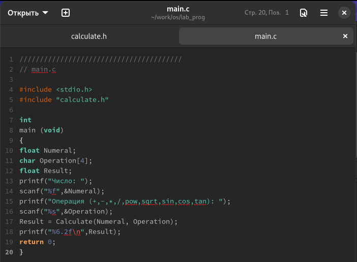

---
## Front matter
lang: ru-RU
title: Лабораторная работа №13
subtitle: Архитектура компьютеров
author:
  - Скандарова П. Ю.
institute:
  - Российский университет дружбы народов, Москва, Россия
date: 29 апреля 2023

## i18n babel
babel-lang: russian
babel-otherlangs: english

## Formatting pdf
toc: false
toc-title: Содержание
slide_level: 2
aspectratio: 169
section-titles: true
theme: metropolis
header-includes:
 - \metroset{progressbar=frametitle,sectionpage=progressbar,numbering=fraction}
 - '\makeatletter'
 - '\beamer@ignorenonframefalse'
 - '\makeatother'
---

# Информация

## Докладчик

  * Скандарова Полина Юрьевна
  * Российский университет дружбы народов
  * [1132221815@pfur.ru](mailto:1132221815@pfur.ru)
  * <https://pyskandarova.github.io/ru/>

# Вводная часть

## Цели и задачи

Приобрести простейшие навыки разработки, анализа, тестирования и отладки приложений в ОС типа UNIX/Linux на примере создания на языке программирования С калькулятора с простейшими функциями.

## Выполнение лабораторной работы

1. В домашнем каталоге создайте подкаталог ~/work/os/lab_prog.
2. Создайте в нём файлы: calculate.h, calculate.c, main.c. Это будет примитивнейший калькулятор, способный складывать, вычитать, умножать и делить, возводить число в степень, брать квадратный корень, вычислять sin, cos, tan. При запуске он будет запрашивать первое число, операцию, второе число. После этого программа выведет результат и остановится.

## Выполнение лабораторной работы

## Выполнение лабораторной работы

## Выполнение лабораторной работы

## Выполнение лабораторной работы

## Выполнение лабораторной работы

:::::::::::::: {.columns align=center}
::: {.column width="50%"}

3. Выполните компиляцию программы посредством gcc:

:::
::: {.column width="50%"}

:::
::::::::::::::

## Выполнение лабораторной работы

4. При необходимости исправьте синтаксические ошибки.
5. Создайте Makefile со следующим содержанием:

## Выполнение лабораторной работы

## Результаты

Приобрести простейшие навыки разработки, анализа, тестирования и отладки приложений в ОС типа UNIX/Linux на примере создания на языке программирования С калькулятора с простейшими функциями.

# Неспасибо за невнимание
